# System Architecture

## High-Level Architecture

```mermaid
graph TB
    Client["🌐 Web Browser / API Client"]
    Gateway["🚪 API Gateway<br/>YARP · Port 5000"]
    DocService["📄 Document Service<br/>.NET 8 · Port 5001"]
    RAGService["🤖 RAG Service<br/>Python FastAPI · Port 5002"]
    ReportService["📊 Report Service<br/>.NET 8 + QuestPDF · Port 5003"]

    PG[("🐘 PostgreSQL<br/>Document Metadata")]
    Mongo[("🍃 MongoDB<br/>File Storage (GridFS)")]
    Chroma[("🔮 ChromaDB<br/>Vector Embeddings")]
    Ollama["🦙 Ollama<br/>llama3.2:1b · nomic-embed-text"]

    Client --> Gateway
    Gateway --> DocService
    Gateway --> RAGService
    Gateway --> ReportService

    DocService --> PG
    DocService --> Mongo
    DocService -.->|"triggers indexing"| RAGService

    RAGService --> Chroma
    RAGService --> Ollama

    ReportService -.->|"queries metadata"| DocService
    ReportService -.->|"queries RAG"| RAGService

    style Gateway fill:#4A90E2,color:#fff
    style DocService fill:#7ED321,color:#fff
    style RAGService fill:#F5A623,color:#fff
    style ReportService fill:#BD10E0,color:#fff
    style PG fill:#336791,color:#fff
    style Mongo fill:#4DB33D,color:#fff
    style Chroma fill:#FF6B6B,color:#fff
    style Ollama fill:#333,color:#fff
```

## Service Communication Patterns

| Pattern | Example | Why |
|---------|---------|-----|
| **Synchronous HTTP** | Gateway → Document Service | Client needs immediate response |
| **Fire-and-forget** | Document Service → RAG indexing | Upload shouldn't wait for indexing |
| **Aggregation** | Report Service → Doc + RAG | Report combines data from multiple sources |
| **Direct service-to-service** | Report Service → Document Service | Avoids circular dependency through gateway |

## RAG Pipeline Flow

```mermaid
sequenceDiagram
    participant User
    participant Gateway
    participant DocService as Document Service
    participant MongoDB
    participant PostgreSQL
    participant RAGService as RAG Service
    participant Ollama
    participant ChromaDB

    Note over User,ChromaDB: 📤 Document Upload & Indexing Flow

    User->>Gateway: POST /api/documents/upload
    Gateway->>DocService: Forward request
    DocService->>MongoDB: Store file (GridFS)
    DocService->>PostgreSQL: Save metadata
    DocService->>DocService: Extract text (PDF/DOCX/TXT)
    DocService->>RAGService: POST /api/rag/index (text + metadata)
    RAGService->>RAGService: Split into chunks (500 chars, 50 overlap)
    RAGService->>Ollama: Generate embeddings (nomic-embed-text)
    Ollama-->>RAGService: Vector embeddings
    RAGService->>ChromaDB: Store vectors + metadata
    RAGService-->>DocService: { chunks_indexed: N }
    DocService->>PostgreSQL: Update status → "Indexed"
    DocService-->>Gateway: 201 Created
    Gateway-->>User: Upload success + document ID

    Note over User,ChromaDB: 🔍 Question Answering Flow

    User->>Gateway: POST /api/rag/query
    Gateway->>RAGService: Forward request
    RAGService->>Ollama: Embed question (nomic-embed-text)
    Ollama-->>RAGService: Question vector
    RAGService->>ChromaDB: Similarity search (top-K chunks)
    ChromaDB-->>RAGService: Relevant chunks + scores
    RAGService->>Ollama: Generate answer (llama3.2:1b + context)
    Ollama-->>RAGService: LLM response
    RAGService-->>Gateway: Answer + source citations
    Gateway-->>User: Response with relevance scores
```

## Report Generation Flow

```mermaid
sequenceDiagram
    participant User
    participant Gateway
    participant ReportService as Report Service
    participant DocService as Document Service
    participant RAGService as RAG Service

    Note over User,RAGService: 📊 Q&A Session Report Generation

    User->>Gateway: POST /api/reports/qa-session
    Gateway->>ReportService: Forward request
    ReportService->>DocService: GET /api/documents/{id}
    DocService-->>ReportService: Document metadata

    loop For each question
        ReportService->>RAGService: POST /api/rag/query
        RAGService-->>ReportService: Answer + sources + scores
    end

    ReportService->>ReportService: Generate PDF (QuestPDF)
    ReportService-->>Gateway: PDF file (application/pdf)
    Gateway-->>User: Download PDF report
```

## Clean Architecture (Per Service)

**Dependency Rule:** Dependencies only point inward. The Core layer has zero dependencies on external libraries. Infrastructure implements Core interfaces. The API layer (Composition Root) wires everything together via dependency injection.

## Docker Network Topology

All services communicate via Docker's internal DNS. Service names (e.g., `document-service`) resolve to container IPs automatically. Ollama runs on the host machine and is accessed via `host.docker.internal`.

## Data Storage Strategy

| Data Type | Storage | Why |
|-----------|---------|-----|
| Document metadata (filename, status, dates) | **PostgreSQL** | Relational queries, indexes, ACID transactions |
| File content (PDF, DOCX, TXT binaries) | **MongoDB GridFS** | Large binary storage, streaming, no 16MB BSON limit |
| Vector embeddings (text chunks) | **ChromaDB** | Optimized for similarity search, in-process |
| LLM models (llama3.2, nomic-embed-text) | **Ollama** (host) | GPU acceleration, model management |

## Key Design Decisions

| Decision | Choice | Reasoning |
|----------|--------|-----------|
| API Gateway | YARP (not Nginx/Traefik) | Native .NET, same language as services, config-driven |
| PDF Generation | QuestPDF (not iText/Telerik) | Free for community, fluent API, lightweight |
| Vector DB | ChromaDB (not Pinecone/Weaviate) | Embedded, no separate server, good for local dev |
| LLM | Ollama (not OpenAI API) | Free, runs locally, privacy, no API key needed |
| Architecture | Clean Architecture | Testability, separation of concerns, interview-ready |
| Service communication | Direct HTTP (not message queue) | Simpler for 4 services, no broker infrastructure needed |
